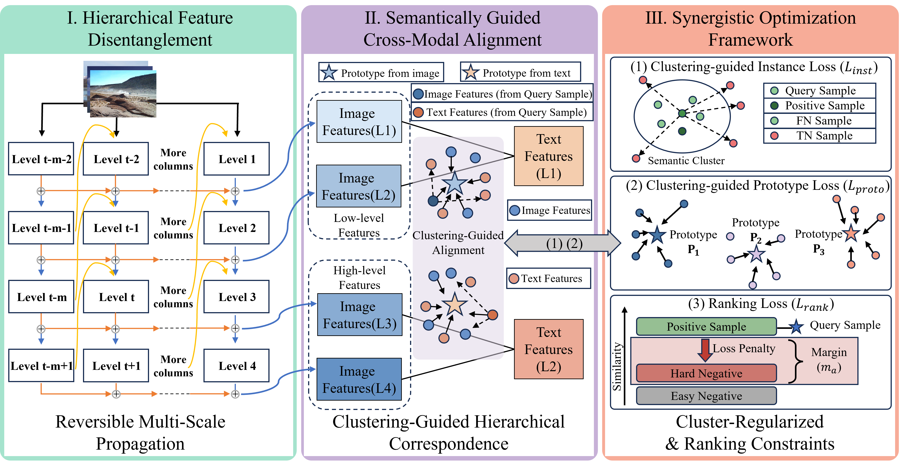

English | [简体中文](README.zh-CN.md)

# HRCH



## Overview

HRCH is a hierarchical hashing model for cross-modal retrieval. This repository contains the main training, evaluation, data loading, and utility code used in our experiments.

## Environment

```bash
conda env create -f HRCH_env.yaml
conda activate HRCH
```

## Datasets

We provide two kinds of data:

- raw datasets
- processed zip packages that can be used directly

Raw dataset downloads:

- MIRFLICKR25K: [Baidu Netdisk](https://pan.baidu.com/s/1vgqIfGeD8-KxXNekoQ-6cw), password: `ubwu`
- IAPR-TC12: [Baidu Netdisk](https://pan.baidu.com/s/1c779W9I_E3szolBcPc_uTQ?pwd=f2ij), password: `f2ij`
- NUS-WIDE (top-10 concept): [Baidu Netdisk](https://pan.baidu.com/s/1mlCVxiSsjp7pcQeQQX-yDw), password: `ru9j`
- MSCOCO: [Baidu Netdisk](https://pan.baidu.com/s/1h7tje0LdSH2x7pZxyvS3-A?pwd=s286), password: `s286`

Processed zip downloads:

- `iapr_tc12.zip`: [Baidu Netdisk](https://pan.baidu.com/s/15Wb8F1MiJoQ7H8FzGnjUQA?pwd=i7nn), password: `i7nn`
- `mirflickr25k.zip`: [Baidu Netdisk](https://pan.baidu.com/s/16gHGAs02I3osv62waH8b6Q?pwd=vfm8), password: `vfm8`
- `mscoco.zip`: [Baidu Netdisk](https://pan.baidu.com/s/1DJWEj-AH61vPtTea6N7eXg?pwd=2unx), password: `2unx`
- `nuswide_tc10.zip`: [Baidu Netdisk](https://pan.baidu.com/s/1TRmLMXfRmtDNYUcuXtHKjw?pwd=z5iu), password: `z5iu`

If you use the processed zip packages, we recommend extracting them under:

```text
/root/autodl-tmp/datasets/
|- mirflickr25k/
|- iapr_tc12/
|- mscoco/
`- nuswide_tc10/
```

Then point `--data_root` to this directory.

If you use the raw datasets, it is recommended to place them under:

```text
/root/autodl-tmp/mirflickr25k
/root/autodl-tmp/IAPR-TC12
/root/autodl-tmp/MSCOCO
/root/autodl-tmp/NUSWIDE
```

The repository already includes the corresponding loading logic, so keeping these folder names unchanged is enough.

For more detailed dataset placement instructions, see [data/DATASET_LOADING.md](data/DATASET_LOADING.md).

## Model Weights

The pretrained weight files are stored under `weights/`. See [weights/README.md](weights/README.md) for details about the weight layout used in this repository.

## Training Example

```bash
python HRCH.py --data_name mirflickr25k --alpha 0.4 --bit 128 --max_epochs 15 --train_batch_size 512 --eval_batch_size 256 --lr 0.000075 --optimizer Adam --warmup_epoch 2 --shift 0.3 --margin 2.8 --tau 0.4 --ins 0.6 --pro 0.8 --entroy 0.01 --qua 0.1 --cluster_num 6000,4000,2000,1000 --gpu 0 --layers 2,2,4,3 --seed 3470 --ld 1
```

## Project Layout

```text
HRCH/
|- clustering_loss/
|- data/
|- models/
|- nets/
|- src/
|- utils/
|- weights/
|- HRCH_env.yaml
|- HRCH.py
|- train.py
|- finetune.py
`- README.md
```
